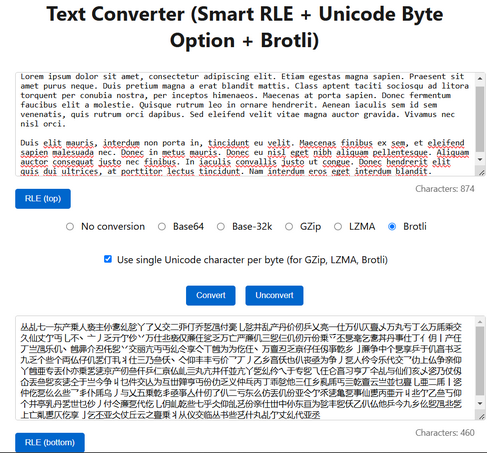

# ASCII Conversion Tool

A web-based tool that provides multiple text conversion algorithms including Base64, Base-32k, GZip, and LZMA compression, with additional support for smart Run-Length Encoding (RLE). The tool is implemented in JavaScript and runs entirely in the browser.

Try it out here: [ASCII Conversion Tool](https://pseudopode.github.io/ascii_conversion/)

## Features

- **Multiple Conversion Methods:**
  - Base64 encoding/decoding
  - Base-32k encoding/decoding (using Unicode characters)
  - GZip compression/decompression
  - LZMA compression/decompression
  - Brotli based compression/decompression (Implementation from https://github.com/dominikhlbg/brotlijs/)

- **Smart Run-Length Encoding (RLE):**
  - Available for both input and output text
  - Implements a "smart" RLE algorithm that only compresses when beneficial
  - Uses "RLEv1:" prefix to indicate encoded content
  - Automatically determines whether to use RLE based on efficiency

- **Unicode Byte Representation:**
  - Option to represent compressed bytes (GZip/LZMA/Brotli) as single Unicode characters
  - Uses characters from the CJK Unified Ideographs block (0x4E00-0x9FFF)
  - Helps avoid issues with unprintable characters

- **User Interface Features:**
  - Real-time character counting
  - Error handling with temporary error messages
  - Responsive design
  - Clear conversion controls

## Implementation Details

### RLE Implementation
The tool uses a smart RLE algorithm that:
1. Identifies consecutive runs of the same character
2. Only applies RLE when the encoded form (`char + count`) is shorter than the raw run
3. Automatically falls back to raw representation when RLE would not save space

### Base-32k Encoding
Utilizes Unicode characters (starting at 0x4E00) to encode data more efficiently than Base64, using approximately 15 bits per character instead of 6 bits.

## Libraries Used
- `pako` (v2.1.0) - For GZip compression
- `lzma-min.js` - For LZMA compression
- Web Workers (`lzma_worker.js`) - For asynchronous LZMA processing

## Development

This project was developed with assistance from:
- GPT-4
- Claude (Anthropic)

## Browser Compatibility

The tool requires a modern browser with support for:
- TextEncoder/TextDecoder APIs
- Web Workers
- ES6+ JavaScript features

## License

This project is licensed under the MIT License. See the LICENSE file for details.

## Contributing

Contributions are welcome! Please feel free to submit a Pull Request.